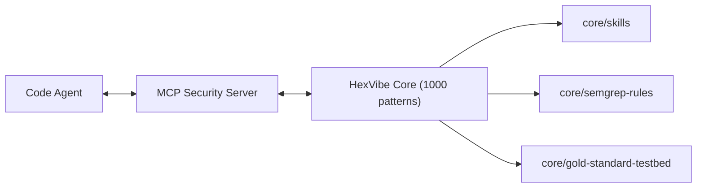

# HexVibe v1.0 — Cognitive AppSec Guardrail

**HexVibe** is an MCP security server for AI-assisted workflows: Semgrep-scale detection plus a **Cognitive Guardrail** (`server/cognitive_engine.py`) so **`findings_primary_log` only promotes high-trust findings** (final `confidence_score` ≥ **0.8**). The shipped ruleset is regression-locked at **1000/1000 HIT** on `core/gold-standard-testbed/`.

---

## Quick Start

### 1) Build & sync

```bash
bash scripts/docker-publish.sh
python scripts/sync_semgrep.py
```

### 2) Run (Docker)

```bash
docker run -i --rm -v "${PWD}:/app" hexvibe-ai:latest
```

### 3) IDE

**Cursor:** Settings → Features → MCP → Add server — **Name** `HexVibe`, **Type** `command`, **Command** `docker run -i --rm -v "${PWD}:/app" hexvibe-ai:latest`  

**Claude Desktop:** copy [`mcp-deployment.json`](mcp-deployment.json) into your MCP config.

### 4) Verify

Ask the agent: *“HexVibe, confirm current baseline.”* Expect **1000** patterns and **v1.0** cognitive metadata.

---

## Cognitive Guardrail

Implemented in `server/cognitive_engine.py` (`extra.cognitive.*`). **Phase 1 — Context Research:** in-file signals + manifests by walking **up to the repo root** (`package.json`, `requirements.txt`, `pyproject.toml`). **Phase 2 — Confidence & comparative analysis:** baseline score, optional **+0.2** when file behavior diverges from manifest-implied stack, then elite **HARD EXCLUSIONS / PRECEDENTS** ([`SECURITY_PRECEDENTS.md`](SECURITY_PRECEDENTS.md)); testbed paths skip this layer so **1000/1000** stays stable. **`attack_path_concrete`** flags plausible user→sink chains. **Phase 3 — Self-critique:** `extra.cognitive.self_critique`; optional `python scripts/cognitive_review_hint.py`.

---

## Official baseline

| Metric | Value |
|--------|--------|
| Rule IDs | **1000** |
| Gold matrix | **1000 / 1000 HIT** |
| Domains | **22** |
| `CWE-*` tokens (patterns) | **≥138** |
| Autofix | **1000 / 1000** (`autofix_available`) |

---

## Capabilities

- **MCP + Docker Architecture** — Integrated Semgrep, TruffleHog, and Syft engine; `server/adapter.py` exposes check execution, automated remediation, and compliance payloads.
- **Exploit Narratives** — Every pattern includes a specific `exploit_scenario` describing real-world attack vectors.
- **Advanced Stack Coverage** — Specialized protection for Document processing (CWE-1236), AI SDKs (Prompt Leakage), and Electron IPC security.
- **Full Pattern Index:** [`core/skills/index.md`](core/skills/index.md)

## Architecture



---

## Development & Extension

- **Modify Rules:** Edit `patterns.md` in the relevant `core/skills/<domain>/` directory and run `python scripts/sync_semgrep.py` to rebuild the ruleset.
- **Extend Testbed:** Add new PoCs under `core/gold-standard-testbed/` using `Vulnerable: PREFIX-NNN` markers to ensure regression testing.
- **Custom Remediations:** HexVibe maps metric IDs to `apply_remediation` calls via the MCP interface for one-click fixes.

---

## Security Operating Principle

Tag PoCs with **`Vulnerable: <PREFIX>-<NNN> (<label>)`**; cite the same IDs in reviews. Do not ship unmitigated violations of known metric IDs without a documented exception.
